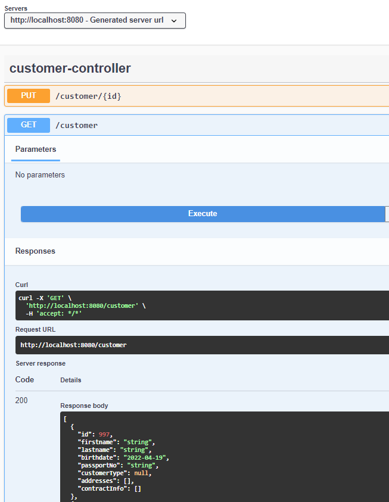
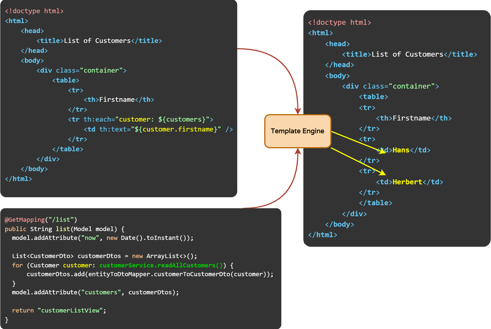

# REST APIs and Spring MVC Server-Side Content Rendering

Dans cette quête vous allez apprendre à créer un client REST dynamique et la différence avec le rendu côté serveur (Server-Side Rendering) de Spring MVC. 

### Ce que vous allez apprendre

* Différences entre Spring MVC et Spring REST
* Utiliser htmx with Thymeleaf for Server-side processing with Client-side content rendering

### Ce que vous devez savoir au préalable

* REST APIs avec Spring Boot
* Spring DI/IoC
* Spring Data / JPA

### Pré-requis

* Le repository cloné en local
* IDE supportant Gradle
* Java SDK 11+

### Htmx pour du rendu dynamique HTML côté client (Client-Side)

Htmx est une librairie JavaScript assez récente permettant de faire du rendu HTML côté client (client dynamique) qui met l'accent sur l'utilisation de HTML plutôt que JavaScript. Une approche très différente de celle d'Angular. Dans cet exercice on l'utilise en combinaison avec Thymeleaf pour obtenir une app dynamique, mais en se concentrant sur le rendu serveur, et sans avoir besoin de mélanger avec du JS.
Htmx permet de réaliser des requêtes AJAX très simplement, de déclencher des transitions CSS, et d'invoquer des WebSockets et des événements directement **depuis** des éléments HTML. Cela nécessiterait traditionnellement une quantité non négligeable de JavaScript même avec jQuery ou des frameworks plus modernes comme React ou Angular.

### Comprendre le service REST "GetCustomers"

Pour comprendre les différences entre les services REST JSON orientés données et les controllers Spring MVC à base de HTML, nous démarrons avec  *GetCustomer*.

#### Appeler le service avec l'API Swagger-UI

Spring Boot active le plugin OpenAPI, qui va générer automatiquement la documentation de nos APIs au format standard OpenAPI, à l'emplacement suivant : http://localhost:8080/v3/api-docs
Avec les informations fournies par OpenAPI, un client peut être généré. Avec la dépendance Swagger dans le `build.gradle` du projet, une UI de découverte de l'API est également générée à l'URL http://localhost:8080/swagger-ui.html

Nous pouvons maintenant utiliser cette UI pour appeler le endpoint REST *GetCustomer* avec *GET /customer* directement dans le browser. La requête et la réponse sont toutes deux en HTTP en JSON, donc aucune balise HTML n'est requise pour rendre les échanges lisibles.



L'annotation `GetMapping` définit la méthode qui sera appelée par la requête */customer* 
Noter que le type MIME `application/json` est utilisé comme un format par défaut, donc le `CustomerDto` est automatiquement converti en JSON et retourné dans la réponse HTTP.

```java
@GetMapping("/customer")
public List<CustomerDto> displayCustomers() {
    List<CustomerDto> customerDtos = new ArrayList<>();
    for (Customer customer: customerService.readAllCustomers()) {
        customerDtos.add(entityToDtoMapper.customerToCustomerDto(customer));
    }
    return customerDtos;
}
```

#### Appeler un service avec du Server-Side rendering MVC et du Client-side HTML Rendering avec Htmx

Nous allons utiliser Thymeleaf pour le rendu serveur; C'est un langage de balises simple qui s'insère dans HTML pour effectuer un traitement sur le contenu de la vue **côté serveur** puis, une fois le HTML final généré, l'envoyer au client en tant que réponse HTTP (de type MIME `text/html` donc)

_Note: Nous utilisons htmx pour améliorer l'aspect dynamique du HTML à partir des données fournies par le serveur. Bien qu'intéressante, la librairie Htmx n'est pas le propos de la formation et vous pouvez donc vous concentrez sur le rendu serveur Thymeleaf_


* Le modèle véhicule les données de l'application. Il reçoit grâce au controller les valeurs saisies par l'utilisateur.
* La vue présente un rendu du modèle correspondant au besoin de l'utilisateur
* Le controller réagit aux saisies et aux actions de l'utilisateur et interagit avec le modèle conceptuel de l'application. Le controller reçoit les valeurs saisies, peut éventuellement les valider (présence / absence, format, ....), et les transmet au modèle.



Le rendu côté serveur utilise Thymeleaf comme un moteur de template. Le moteur de template est chargé de garnir la vue (dans notre cas HTML) des données issues de l'état de l'application (données venant in fine de la base de données). Le controller, lui, est en charge de faire le lien entre la vue et le modèle (dans notre cas géré par Spring MVC).
