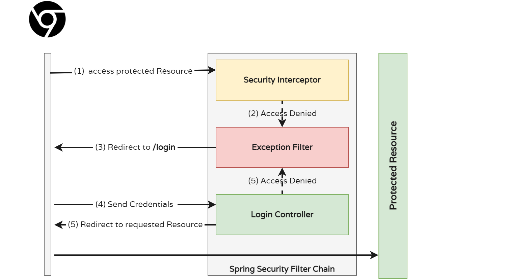
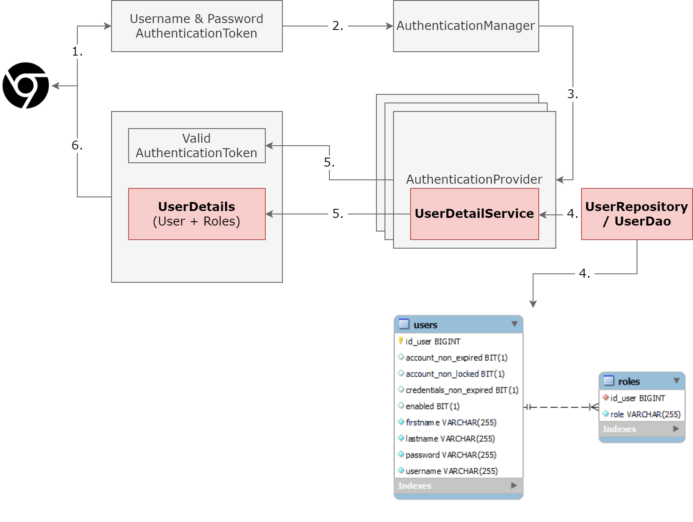
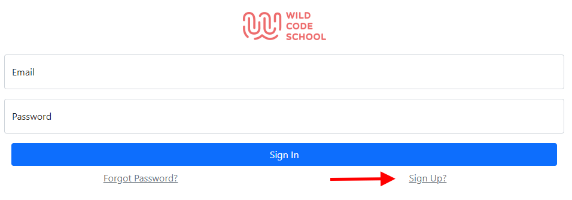

# Securing REST Services with Spring Security

In this quest you will learn about Securing your REST services with Authentication & Authorization using Spring Security.

### What you will learn

* Understandig Authentication & Authorization implementation of Spring Security
* Securing REST services with Spring Security

### What you should know

* DI/IoC with the Spring Framework
* Spring MVC and Spring REST

### Prerequisites

* Locally cloned Repository
* IDE (IntelliJ) with Gradle
* Java SDK 11+

## Spring DI/IoC, Spring Boot and REST

**_Note: To run this application, run the main class `TariffManagerApplication` and open http://localhost:8080/_**

You saw this diagram in the Spring Boot REST session. With this setup, we can call `CustomerController` Endpoints (Methods) via HTTP and the call will ripple to the other layers of our application, like `CustomerService` and `CustomerRepository`.

Even though this `CustomerController` is a REST service, we can as well have a Spring MVC Controller registered at some URL, eg http://localhost:8080/public/customer/list


The problem with this setup is that it is open and publicly accessible without any restrictions. Everyone with access to our server can access all Spring MVC Views and all REST Service Endpoints.

### Resource Protection with Spring Security



### Authentication & Authorization Flow



### Walk-Through Spring Security Setup

_Note: We will use Thymeleaf to render all HTML pages, therefore the access to *.html files is restricted. HTML is only served via Spring MVC and Thymeleaf._

So the `index.html` redirects to the Controller at */public/index/view*, which delegated to `indexview.html`

For the `RestrictedView` Controller we only want _authenticated_ Users to be able to access the page. 

```java
@Controller
@RequestMapping("/public/restricted")
public class RestrictedView {
    @GetMapping("/view")
    public String list(Model model) {
        model.addAttribute("now", new Date().toInstant());
        return "restricted";
    }
}
```

To restrict the access to this Controller, we choose _URL-based access restriction_, not _Resourse-based access restriction_. This other option will be used in a later step.
To enable URL-based access restrictions, we have to

1. Enable User Sign-Up and Sign-In
2. Enable Roles for Users
3. Build a Security Filter Chain to validate authentication and authorization
4. Configure the `UserRepository`, the `UserService` and password handling

For reference: all necessary steps are explained in the Spring Guides: https://spring.io/guides/gs/securing-web/

#### User Handling (Sign-Up/Sign-In)

We start with the main configuration at [WebSecurityConfig](../../../src/main/java/dev/wcs/nad/tariffmanager/identity/config/WebSecurityConfig.java).
You will see two classes which are injected per Constructor-injection with the Spring-Framework: `SecurityUserService` and `PasswordEncoder`.

Follow the `SecurityUserService` to understand how the persistence of the Users is implemented. You will see many patterns from Spring Data JPA, but it's straightforward. The `PasswordEncoder` is used to strongly hash the User's password in a standardized way and only store the hashed password. Note that the password can never be derived from the stored hash, it only works the other way around, so the User's password is hashed and then compared to the stored hash.

_This pattern is very important to understand and use: never store a password in the database, not even an encrypted one._  

#### Configure Spring Security

All security-related configuration is done in `WebSecurityConfig.configure`. Follow the fluent config and check that you understand how this configuration works. You can always add or remove parts to verify your assumptions.

### Run the application with security enabled

* You have to sign up first as there are no users stored initially.
* Access a restricted resource like "User Settings"
* You will be redirected to the login screen. Signup here.



* In the log file you will see an exception and a link. Click on this link.
* Your user was created, login now with your credentials. 

### Change the Configuration Challenges

#### 🔬 Authentication & Authorization: Role-based Access Management

* To understand the difference between Authentication & Authorization look into [auth0 comparison](https://auth0.com/docs/get-started/identity-fundamentals/authentication-and-authorization).
* Read more about Spring Security and the configuration [here](https://www.marcobehler.com/guides/spring-security).

### Challenge: Only Authenticated Users should see User Settings

Change the configuration to only allow **authenticated Users** to access the **restricted User Settings** site. Currently, all Users, even if not logged in, can access the **restricted User Setting** page.

To implement this requirement, add an URL-based Access Restriction on **/public/restricted/**.

### Challenge: Add Roles to Check Customer List page

Change the configuration to only allow authenticated Users with the Role **BACKOFFICE** (ie. only Users with Role **BACKOFFICE** are _authorized_) to access the **Customer list view** site. Currently, all Users, even if not logged in, can access the **Customer list view** page.
To implement this requirement, add an URL-based Access Restriction on **/public/customer/**.

For simplicity, the logic currently derives the Role from the mail address.

```java
if (this.getUsername().contains("admin@")) {
    grantedAuthorities.add(new SimpleGrantedAuthority("ROLE_ADMIN"));
} else if (this.getUsername().contains("backoffice@")){
    grantedAuthorities.add(new SimpleGrantedAuthority("ROLE_BACKOFFICE"));
} else {
    grantedAuthorities.add(new SimpleGrantedAuthority("ROLE_USER"));
}
```

You will have to create a new User with eg. **backoffice@company.com** to have one user with the Role **BACKOFFICE**.

### Challenge: Add a Secured Admin Page for Role ADMIN only

The admin page is currently accessible for all Users! It should only be accessible for Users with Role **ADMIN**, add an URL-based Access Restriction on **/public/admin/**. 
