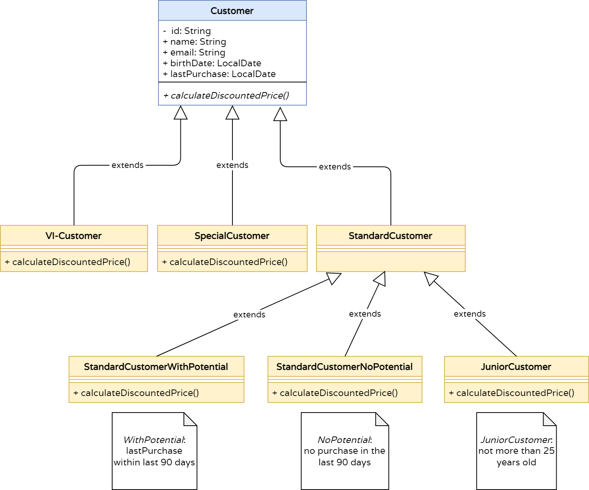

## Introduction to Object-Oriented Programming & Java

### Objective

In this block, Students learn basics about Object-Oriented Programming and get to know Java, the JDK and Standard Libraries.

### What will Students learn?

* OOP Programming Concepts: Inheritance, Composition, Interfaces
* Sample for Object Graph with Inheritance and Polymorphism

### Use Case: Calculate Discounts for Customers depending on their Relevance

```
As a customer, I want to see the discount I get on a Tariff and its Options.
```

### Data Model of Tariff-Manager Customers

A Tariff-Manager `Customer` can have different attributes, which help classifying this `Customer`.

Depending on their rating (which is external to this system), `Customer` are ranked for `VI-Customer`, `SpecialCustomer`, or `StandardCustomer`.  

A `StandardCustomer` can be further classfied as `StandardCustomerWithPotential`, `StandardCustomerNoPotential`, or `JuniorCustomer`. The criteria for any customer type are stated in the diagram.

### Data Model Implementation in Object-Oriented Languages



In OOP Languages, the implementation of the specified data model is realized by Inheritance, Abstract Classes and Interfaces.

#### Starting with the base class: the generic `Customer`


