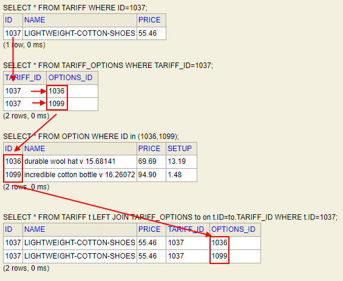
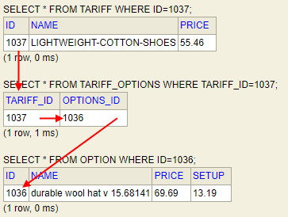

# Spring Data JPA

Dans cette quête vous allez apprendre à effectuer des requêtes vers une base SQL avec Spring Data & JPA. 

### Ce que vous allez apprendre

* Java et les bases de données relationnelles : JDBC
* Persistence avec un ORM en Java / Spring : Spring Data / JPA

### Ce que vous devez savoir au préalable

* Java Basics
* Spring DI/IoC

### Pré-requis

* Le repository cloné en local
* IDE supportant Gradle
* Java SDK 17+

## Introduction à Java Persistence API (JPA)

Dans ce didacticiel, vous allez découvrir comment créer un modèle de données avec JPA.

### Entités du domaine "Tariff-Manager"

#### Tariff

* Nom du Tariff 
* Prix
* Liste des options possibles

#### Option

* Nom de l'option
* Prix
* Cout de la connexion

#### Customer

* Nom du client
* Last Name
* Date de naissance
* Données de passeport
* Adresse

#### Contract

* Numéro de contrat
* Le Tariff associé
* Options sélectionnée sur le tariff

### Modèle de données et diagramme de relations entre Entités


## Créer les classes JPA

### Diagrammme de classe correspondant au diagramme JPA


### Annotations d'Entités 

Pour activer le mapping Relationnel-Objet (ORM) entre les objets Java et les entités base de données, les classes Java doivent être enrichies avec des méta-informations définissant comment associer le modèle avec la base de données. Comment et combien d'objets charger à chaque fois.

JPA utilise des annotations spécifiques (ou une configuration XML) pour définir le comportement attendu. Toutes les entités JPA du package *entity* auront ces annotations.  

[sources](../../../src/main/java/dev/wcs/nad/tariffmanager/persistence/entity/) | [GitHub](../../../src/main/java/dev/wcs/nad/tariffmanager/persistence/entity/)

### Modéliser les relations _One-to-Many_

Nous allons rentrer dans le détail de la relation `Contact` / `Address`. Cette relation représente le fait "qu'un contact m addresses".
This relation type is called `One-to-Many` (1..n) in JPA. En Java, on utilise une `Collection` (dans notre cas, une `List`, mais `Set` et `Collection` marcheraient aussi) pour représenter une relation 1..n.

```
@OneToMany(mappedBy = "customer", orphanRemoval = true)
private List<Contract> contracts = new ArrayList<>();
```
[sources](../../../src/main/java/dev/wcs/nad/tariffmanager/persistence/entity/Customer.java) | [GitHub](../../../src/main/java/dev/wcs/nad/tariffmanager/persistence/entity/Customer.java#L28)



#### Ajouter une `Address` à un `Contact`

Si nous souhaitons ajouter une `Address` à un objet `Contact`, nous devons utiliser l'API de l'interface `List`. A la suite de cela nous devrons persister les changements dans la base de données via les repositories.

```java
Address address = createFakeAddress();
Contact contact = createFakeContact();
contact.addAddress(address);
addressRepository.save(address);
contactRepository.save(contact);
```

[sources](../../../src/test/java/dev/wcs/nad/tariffmanager/InitialDatabaseSetupManualTest.java) | [GitHub](../../../src/test/java/dev/wcs/nad/tariffmanager/InitialDatabaseSetupManualTest.java#L32)

En premier lieu, nous créons une nouvelle `Address` que l'on ajoute au `Contact`. Il suffit d'appeler `add(...)` sur la `List` d'`Address`. L'objet a bien été ajouté à la liste en mémoire, mais le changement n'a pas été enregistrée en base de données. Pour persister cet objet, il faut d'abord le faire pour la nouvelle `Address` avec `addressRepository.save(address)`. Désormais, un ID a été généré par JPA pour cette adresse et nous pouvons donc sauvegarder l'objet `Contact` avec sa `List` d'`Address` via le `contactRepository.save(contact)`.

Dans la base de données, dans la table **ADDRESS**, la colonne **CONTACT_ID** a une clef étrange (FK, Foreign Key) vers la table **CONTACT**, vers la colonne **ID**.  


La façon dont cette relation est structurée en base de données peut être spécifiée par les annotations dans les classes entités `Address` et `Contact`. L'approche consistant à stocker dans une table adresse dédiée est la plus courange, mais d'autres options existent, par ex. utiliser une table de jointure.

### Modéliser les relations Many-to-Many


```java
@ManyToMany
@JoinTable(name = "contract_options",
        joinColumns = @JoinColumn(name = "contract_id"),
        inverseJoinColumns = @JoinColumn(name = "options_id"))
private Set<Option> options = new LinkedHashSet<>();
```
[sources](../../../src/main/java/dev/wcs/nad/tariffmanager/persistence/entity/Contract.java) | [GitHub](../../../src/main/java/dev/wcs/nad/tariffmanager/persistence/entity/Contract.java#L25)


### Modéliser les relations One-to-One



```java
@OneToOne(orphanRemoval = true)
@JoinColumn(name = "tariff_id")
private Tariff tariff;
```
[sources](../../../src/main/java/dev/wcs/nad/tariffmanager/persistence/entity/Contract.java) | [GitHub](../../../src/main/java/dev/wcs/nad/tariffmanager/persistence/entity/Contract.java#L21)

### Modéliser les relations Many-to-One

```java
@ManyToOne
@JoinColumn(name = "contact_id")
private Contact contact;
```
[sources](../../../src/main/java/dev/wcs/nad/tariffmanager/persistence/entity/Address.java) | [GitHub](../../../src/main/java/dev/wcs/nad/tariffmanager/persistence/entity/Address.java#L24)

### Challenge: Ajouter une nouvelle entité `Department` 

* Un `Tariff` a une relation n..0 (many-to-zero_or_one) vers une nouvelle entité `Department`, qui détermine quel départment interne est responsable de ce `Tariff`
* Créer un repository pour `Department` qui permet la lecture, la création et la modification de l'entité `Department` (méthodes: ...)
* Optionnel : créer un test unitaire pour créer un `Tariff` et y associer un `Department`. Vérifier que le tariff est bien créé avec son département en base de données

